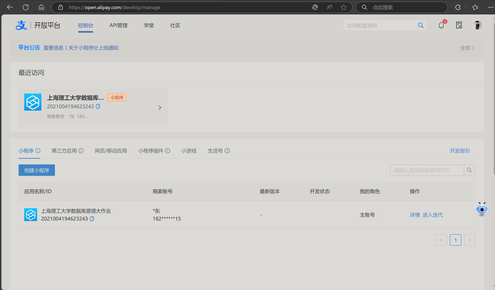

# 说明

这是上海理工大学`javaweb`大作业的电商项目模块。

## 运行环境

用的不是最新的mysql8.0.35，而是mysql8.0.11，所以要注意查看有没有下载对应的mysql版本的驱动包。

用的注册中心是consul，需要下载对应运行程序，确保在8500端口上启动好服务注册中心。

官网详见：[Consul by HashiCorp](https://www.consul.io/)

下载完成对应的版本之后，输入

```bash
consul agent -dev
```

来启动consul

之后访问http://localhost:8500即可查看所有启动的微服务

## 效果

后端采用Spring Cloud框架，采用微服务架构。将服务拆分成登录模块，支付模块，商品模块三大模块。数据库使用Mysql。

项目结构如下：

​                               

其中，alipay继承了支付宝的支付模块，android是安卓端的代码，common用来存放公共VO，DTO，POJO类，gateway是微服务网关，login是登录模块，order是商品订单模块。sql的生成文件放在了common文件夹下方，有个.db结尾的文件，就是它了。

数据库主要是四张表：

 

ER图结构如下：

 

## 关于支付

后端调用了阿里支付宝的沙箱环境，所以需要登录支付宝官网，申请支付沙箱环境。详见官网：[沙箱环境 - 支付宝文档中心](https://opendocs.alipay.com/common/02kkv7?pathHash=9a45a6d6)



把申请得到的appId，appPrivateKey，alipayPublicKey填入shopping_backend\alipay\src\main\resources\application.yaml文件即可。

同时，需要frp配置一下内网穿透，以确保前端支付完成之后，后端可以得到支付完成的消息。

### Frp配置

详见这篇文章：[通过 docker 部署 frp 内网穿透（Linux and Windows）-腾讯云开发者社区-腾讯云](https://cloud.tencent.com/developer/article/2455943)

frpc.ini文件：

```ini
[common]
# server_addr为云服务器IP地址
server_addr = xxx.xxx.xxx.xxx
# server_port为服务端监听端口，bind_port
server_port = xxx
# 服务端设置的token
token = xxx

# 添加穿透端口1
[tomcat]
type = tcp
local_ip = 127.0.0.1
local_port = 8080
remote_port = 8080

```

