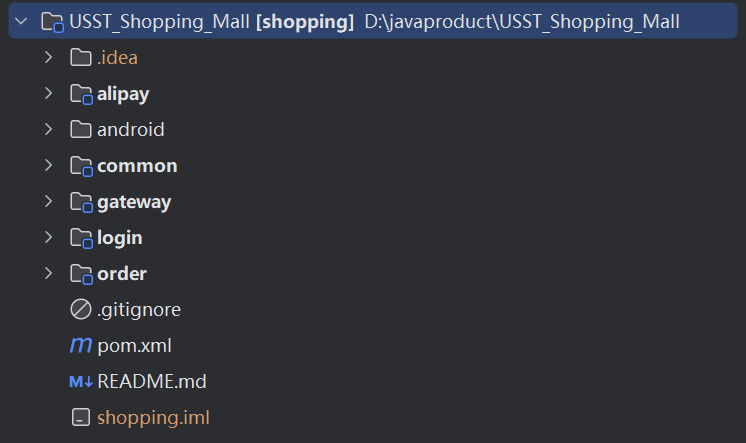
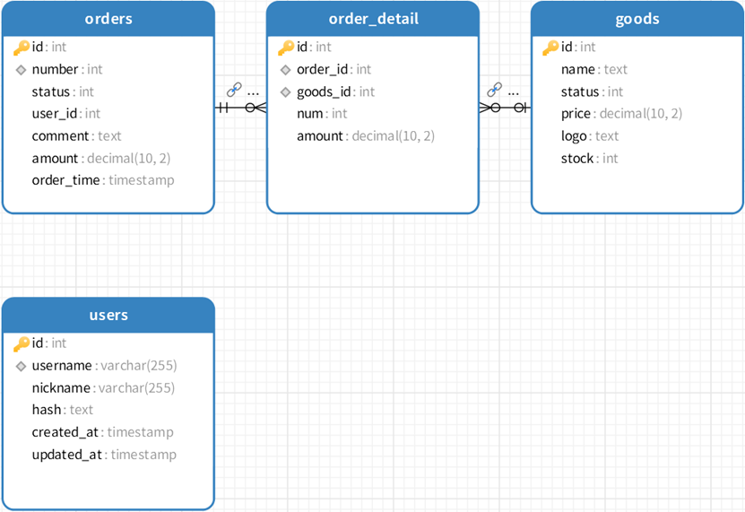

# 说明

这是上海理工大学`javaweb`大作业的电商项目模块。

## 运行环境

用的不是最新的mysql8.0.35，而是mysql8.0.11，所以要注意查看有没有下载对应的mysql版本的驱动包。

用的注册中心是consul，需要下载对应运行程序，确保在8500端口上启动好服务注册中心。

## 效果

后端采用Spring Cloud框架，采用微服务架构。将服务拆分成登录模块，支付模块，商品模块三大模块。数据库使用Mysql。

项目结构如下：

​                               

其中，alipay继承了支付宝的支付模块，android是安卓端的代码，common用来存放公共VO，DTO，POJO类，gateway是微服务网关，login是登录模块，order是商品订单模块。sql的生成文件放在了common文件夹下方，有个.db结尾的文件，就是它了。

数据库主要是四张表：

 

ER图结构如下：

 

